# System Architecture Overview

> [!context]
> healthOS is an AI-powered health intelligence platform built as a next-forge turborepo monorepo. It combines a general-purpose AI chat system (chat-js) with health-specific intelligence (Garmin integration, biometric analysis, training optimization).
>
> Last validated: 2026-03-18 via local dev session with all apps verified.

## Architecture Diagram

```mermaid
graph TB
    subgraph External Services
        BETTER_AUTH["Better Auth<br/>(Auth)"]
        STRIPE["Stripe<br/>(Billing)"]
        NEON["Neon PostgreSQL<br/>(Database)"]
        SENTRY["Sentry<br/>(Observability)"]
        POSTHOG["PostHog<br/>(Analytics)"]
        LOGTAIL["Logtail<br/>(Logging)"]
        LIVEBLOCKS["Liveblocks<br/>(Collaboration)"]
        BASEHUB["BaseHub<br/>(CMS)"]
        RESEND["Resend<br/>(Email)"]
        UPSTASH["Upstash<br/>(Rate Limit)"]
        GARMIN["Garmin Connect<br/>(Health Data)"]
    end

    subgraph AI Providers
        ANTHROPIC["Anthropic<br/>(Claude)"]
        OPENAI["OpenAI<br/>(GPT)"]
        GOOGLE_AI["Google AI<br/>(Gemini)"]
        OLLAMA["Ollama<br/>(Local)"]
    end

    subgraph "Apps (Next.js 16)"
        HEALTH["health<br/>Health Intelligence :3011"]
        CHAT["chat<br/>AI Chat :3010"]
        APP["app<br/>Dashboard :3000"]
        API["api<br/>API + Webhooks :3002"]
        WEB["web<br/>Marketing :3001"]
        DOCS["docs<br/>Mintlify :3004"]
        EMAIL["email<br/>React Email :3003"]
        STORYBOOK["storybook<br/>Component Dev :6006"]
    end

    subgraph "Packages (@repo/*)"
        AUTH["@repo/auth"]
        DB["@repo/database"]
        PAY["@repo/payments"]
        DS["@repo/design-system"]
        OBS["@repo/observability"]
        ANALYTICS["@repo/analytics"]
        AI_PKG["@repo/ai"]
        HT["@repo/health-tools"]
        COLLAB["@repo/collaboration"]
        CMS_PKG["@repo/cms"]
        EMAIL_PKG["@repo/email"]
    end

    HEALTH --> AUTH
    HEALTH --> DB
    HEALTH --> AI_PKG
    HEALTH --> DS
    HEALTH --> HT

    CHAT --> AUTH
    CHAT --> DB
    CHAT --> AI_PKG
    CHAT --> DS
    CHAT --> HT

    APP --> AUTH
    APP --> DB
    APP --> DS
    APP --> OBS
    APP --> COLLAB

    API --> AUTH
    API --> DB
    API --> PAY
    API --> OBS
    API --> ANALYTICS

    WEB --> DS
    WEB --> CMS_PKG

    AUTH --> BETTER_AUTH
    DB --> NEON
    PAY --> STRIPE
    OBS --> SENTRY
    OBS --> LOGTAIL
    ANALYTICS --> POSTHOG
    COLLAB --> LIVEBLOCKS
    CMS_PKG --> BASEHUB
    EMAIL_PKG --> RESEND
    HT --> GARMIN

    AI_PKG --> ANTHROPIC
    AI_PKG --> OPENAI
    AI_PKG --> GOOGLE_AI
    AI_PKG --> OLLAMA
```

## Application Layer

healthOS runs 8 applications (plus a stale studio app), each a separate workspace.

| App | Port | Purpose | Status (2026-03-18) |
|-----|------|---------|---------------------|
| `health` | 3011 | Health AI chat with Claude Haiku 4.5, Garmin tools, biometric analysis | Working |
| `chat` | 3010 | Multi-provider AI chat (GPT-5 nano, etc.), branching, MCP | Working |
| `app` | 3000 | Shell dashboard (next-forge default placeholder) | Working (404 expected) |
| `api` | 3002 | REST API + Stripe webhooks | Working (404 on root expected) |
| `web` | 3001 | Public marketing site | Needs BASEHUB_TOKEN |
| `docs` | 3004 | API documentation (Mintlify) | Working |
| `email` | 3003 | Email template development (React Email) | Working |
| `storybook` | 6006 | Component development (Storybook 10) | Working |
| `studio` | 5555 | STALE: Expects Prisma, project uses Drizzle | Not working |

See [[architecture/app-dashboard]] and [[architecture/app-api]] for detailed architecture of the primary apps.

## Package Layer

Shared packages under `packages/` provide cross-cutting functionality. See [[architecture/package-map]] for the complete dependency graph.

Key packages:
- `@repo/ai` -- AI SDK v6 multi-provider gateway + ToolLoopAgent
- `@repo/health-tools` -- Garmin query, health snapshot, sleep, training, vitals, nutrition correlation
- `@repo/auth` -- Better Auth (Google, GitHub, anonymous sessions)
- `@repo/database` -- Drizzle ORM + Neon PostgreSQL (16 tables)

## Data Flow

The primary data flow is:

1. User authenticates via Better Auth (Google/GitHub OAuth or anonymous) in `apps/health` or `apps/chat`
2. Auth creates user/session records in Neon PostgreSQL via Drizzle ORM
3. Chat messages are stored in the `message` table with AI SDK parts format
4. Health tools query Garmin Connect API for biometric data
5. AI providers (Claude, GPT, Gemini) generate responses via `@repo/ai`
6. Stripe webhooks update subscription state via `apps/api`

See [[architecture/data-flow]] for detailed request flow diagrams.

## Technology Stack

| Layer | Technology | Version |
|-------|-----------|---------|
| Framework | Next.js | 16 |
| Language | TypeScript | 5.9 |
| Package Manager | Bun | 1.3.10 |
| Build System | Turborepo | 2.8+ |
| Linter | Biome | 2.4.6 |
| Test Runner | Vitest | 4.0+ |
| ORM | **Drizzle** | Latest (drizzle-orm + drizzle-kit) |
| Database | Neon PostgreSQL | Serverless (project: purple-mouse-62653625, aws-us-east-1) |
| Auth | **Better Auth** | Latest (Google, GitHub, anonymous) |
| AI | AI SDK | v6 (Anthropic, OpenAI, Google, Ollama) |
| Payments | Stripe | stripe 20.x |
| Observability | Sentry | @sentry/nextjs 10.x |
| UI Components | shadcn/ui | Via @repo/design-system |
| Styling | Tailwind CSS | v4 |

> [!important]
> The ORM is **Drizzle** (NOT Prisma) and auth is **Better Auth** (NOT Clerk). Some documentation and file naming may still reference the old providers due to next-forge scaffolding origins.

## Known Issues (2026-03-18)

| Issue | Severity | Workaround |
|-------|----------|------------|
| `apps/web` needs BASEHUB_TOKEN | Low | Skip or mock CMS data |
| `apps/studio` expects Prisma | Low | Use `drizzle-kit studio` instead |
| Stripe CLI not installed | Low | `brew install stripe/stripe-cli/stripe` |
| Some docs reference Prisma/Clerk | Medium | Refer to source code and CLAUDE.md for ground truth |

## Related

- [[architecture/monorepo-topology]] -- Workspace structure
- [[architecture/package-map]] -- All packages with dependencies
- [[architecture/data-flow]] -- Request flow diagrams
- [[decisions/adr-001-next-forge]] -- Why next-forge
