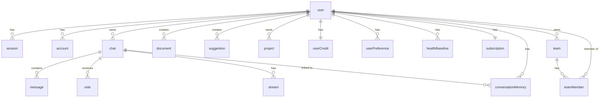

# Database Schema

> [!context]
> This documents the Drizzle ORM schema for healthOS Platform, defined in `packages/database/schema.ts`. The database is Neon PostgreSQL, accessed via `drizzle-orm/postgres-js` with the `postgres` driver.
>
> **Important**: The ORM is Drizzle (NOT Prisma). The database connection uses `postgres` (not `@prisma/adapter-neon`).

## Schema Configuration

```typescript
// packages/database/drizzle.config.ts
import { defineConfig } from "drizzle-kit";

export default defineConfig({
  dialect: "postgresql",
  schema: "./schema.ts",
  out: "./migrations",
  dbCredentials: {
    url: process.env.DATABASE_URL ?? "",
  },
});
```

## Database Connection

```typescript
// packages/database/index.ts
import { drizzle } from "drizzle-orm/postgres-js";
import postgres from "postgres";
import * as schema from "./schema";

const client = postgres(databaseUrl);
export const database = drizzle(client, { schema });
```

> [!important]
> The `@repo/database` package imports `server-only`, preventing accidental client-side imports that would expose the database connection string.

## Current Schema (16 tables)

Validated against `packages/database/schema.ts` on 2026-03-18.

### Entity Relationship Diagram



### Auth Tables (Better Auth)

#### user

| Column | Type | Constraints | Description |
|--------|------|-------------|-------------|
| `id` | varchar(36) | PK | Better Auth user ID |
| `name` | text | NOT NULL | Display name |
| `email` | text | NOT NULL, UNIQUE | Email address |
| `email_verified` | boolean | NOT NULL, default false | Email verification status |
| `image` | text | nullable | Profile image URL |
| `created_at` | timestamp | NOT NULL, default now() | |
| `updated_at` | timestamp | NOT NULL, default now() | |

#### session

| Column | Type | Constraints | Description |
|--------|------|-------------|-------------|
| `id` | varchar(36) | PK | Session ID |
| `expires_at` | timestamp | NOT NULL | Session expiry |
| `token` | text | NOT NULL, UNIQUE | Session token |
| `ip_address` | text | nullable | Client IP |
| `user_agent` | text | nullable | Client user agent |
| `user_id` | varchar(36) | FK -> user, cascade | Owning user |
| `created_at` | timestamp | NOT NULL, default now() | |
| `updated_at` | timestamp | NOT NULL, default now() | |

#### account

| Column | Type | Constraints | Description |
|--------|------|-------------|-------------|
| `id` | varchar(36) | PK | Account ID |
| `account_id` | text | NOT NULL | Provider account ID |
| `provider_id` | text | NOT NULL | OAuth provider (google, github) |
| `user_id` | varchar(36) | FK -> user, cascade | Owning user |
| `access_token` | text | nullable | OAuth access token |
| `refresh_token` | text | nullable | OAuth refresh token |
| `id_token` | text | nullable | OAuth ID token |
| `access_token_expires_at` | timestamp | nullable | Token expiry |
| `refresh_token_expires_at` | timestamp | nullable | Refresh token expiry |
| `scope` | text | nullable | OAuth scopes |
| `password` | text | nullable | Password hash (if using credentials) |
| `created_at` | timestamp | NOT NULL, default now() | |
| `updated_at` | timestamp | NOT NULL, default now() | |

#### verification

| Column | Type | Constraints | Description |
|--------|------|-------------|-------------|
| `id` | varchar(36) | PK | Verification ID |
| `identifier` | text | NOT NULL | What is being verified |
| `value` | text | NOT NULL | Verification value |
| `expires_at` | timestamp | NOT NULL | Expiry |
| `created_at` | timestamp | NOT NULL, default now() | |
| `updated_at` | timestamp | NOT NULL, default now() | |

### Chat Tables

#### chat

| Column | Type | Constraints | Description |
|--------|------|-------------|-------------|
| `id` | uuid | PK, default random | Chat ID |
| `title` | text | NOT NULL | Chat title |
| `user_id` | varchar(36) | FK -> user, cascade | Owning user |
| `visibility` | varchar(20) | NOT NULL, default "private" | "private" or "public" |
| `created_at` | timestamp | NOT NULL, default now() | |
| `updated_at` | timestamp | NOT NULL, default now() | |

#### message

| Column | Type | Constraints | Description |
|--------|------|-------------|-------------|
| `id` | uuid | PK, default random | Message ID |
| `chat_id` | uuid | FK -> chat, cascade | Parent chat |
| `role` | varchar(20) | NOT NULL | "user", "assistant", "system", "tool" |
| `parts` | json | NOT NULL | Message content parts (AI SDK format) |
| `attachments` | json | nullable | File attachments |
| `created_at` | timestamp | NOT NULL, default now() | |

#### vote

| Column | Type | Constraints | Description |
|--------|------|-------------|-------------|
| `chat_id` | uuid | FK -> chat, cascade | Chat reference |
| `message_id` | uuid | FK -> message, cascade | Message reference |
| `is_upvoted` | boolean | NOT NULL | Upvote or downvote |

#### document

| Column | Type | Constraints | Description |
|--------|------|-------------|-------------|
| `id` | uuid | NOT NULL | Document ID (not auto-generated) |
| `title` | text | NOT NULL | Document title |
| `content` | text | nullable | Document content |
| `kind` | varchar(20) | NOT NULL, default "text" | Document type |
| `user_id` | varchar(36) | FK -> user, cascade | Owning user |
| `created_at` | timestamp | NOT NULL, default now() | |

#### suggestion

| Column | Type | Constraints | Description |
|--------|------|-------------|-------------|
| `id` | uuid | PK, default random | Suggestion ID |
| `document_id` | uuid | NOT NULL | Target document |
| `document_created_at` | timestamp | NOT NULL | Document version timestamp |
| `original_text` | text | NOT NULL | Text to replace |
| `suggested_text` | text | NOT NULL | Replacement text |
| `description` | text | nullable | Why the suggestion was made |
| `is_resolved` | boolean | NOT NULL, default false | Resolution status |
| `user_id` | varchar(36) | FK -> user, cascade | Suggesting user |
| `created_at` | timestamp | NOT NULL, default now() | |

#### stream

| Column | Type | Constraints | Description |
|--------|------|-------------|-------------|
| `id` | uuid | PK, default random | Stream ID |
| `chat_id` | uuid | FK -> chat, cascade | Parent chat |
| `created_at` | timestamp | NOT NULL, default now() | |

### Project & Credits Tables

#### project

| Column | Type | Constraints | Description |
|--------|------|-------------|-------------|
| `id` | uuid | PK, default random | Project ID |
| `name` | text | NOT NULL | Project name |
| `description` | text | nullable | Project description |
| `user_id` | varchar(36) | FK -> user, cascade | Owning user |
| `created_at` | timestamp | NOT NULL, default now() | |
| `updated_at` | timestamp | NOT NULL, default now() | |

#### user_credit

| Column | Type | Constraints | Description |
|--------|------|-------------|-------------|
| `id` | uuid | PK, default random | Credit record ID |
| `user_id` | varchar(36) | FK -> user, cascade, UNIQUE | One per user |
| `credits` | integer | NOT NULL, default 100 | Credit balance |
| `created_at` | timestamp | NOT NULL, default now() | |
| `updated_at` | timestamp | NOT NULL, default now() | |

### Agent Memory Tables

#### user_preference

| Column | Type | Constraints | Description |
|--------|------|-------------|-------------|
| `id` | uuid | PK, default random | Preference ID |
| `user_id` | varchar(36) | FK -> user, cascade | Owning user |
| `key` | varchar(100) | NOT NULL | Preference key |
| `value` | text | NOT NULL | Preference value |
| `created_at` | timestamp | NOT NULL, default now() | |
| `updated_at` | timestamp | NOT NULL, default now() | |

#### health_baseline

| Column | Type | Constraints | Description |
|--------|------|-------------|-------------|
| `id` | uuid | PK, default random | Baseline ID |
| `user_id` | varchar(36) | FK -> user, cascade | Owning user |
| `metric` | varchar(50) | NOT NULL | Metric name (e.g., "resting_hr") |
| `mean` | text | NOT NULL | Mean value |
| `stddev` | text | nullable | Standard deviation |
| `sample_size` | integer | NOT NULL, default 0 | Number of samples |
| `last_updated` | timestamp | NOT NULL, default now() | Last recalculation |
| `created_at` | timestamp | NOT NULL, default now() | |

#### conversation_memory

| Column | Type | Constraints | Description |
|--------|------|-------------|-------------|
| `id` | uuid | PK, default random | Memory ID |
| `user_id` | varchar(36) | FK -> user, cascade | Owning user |
| `chat_id` | uuid | FK -> chat, set null | Source chat (nullable) |
| `fact` | text | NOT NULL | Remembered fact |
| `category` | varchar(50) | NOT NULL | Fact category |
| `confidence` | text | nullable | Confidence level |
| `expires_at` | timestamp | nullable | When fact expires |
| `created_at` | timestamp | NOT NULL, default now() | |

### Subscription Tables

#### subscription

| Column | Type | Constraints | Description |
|--------|------|-------------|-------------|
| `id` | uuid | PK, default random | Subscription ID |
| `user_id` | varchar(36) | FK -> user, cascade, UNIQUE | One per user |
| `plan` | varchar(20) | NOT NULL, default "free" | Plan tier |
| `stripe_customer_id` | text | nullable | Stripe customer reference |
| `stripe_subscription_id` | text | nullable | Stripe subscription reference |
| `status` | varchar(20) | NOT NULL, default "active" | Subscription status |
| `current_period_end` | timestamp | nullable | Current billing period end |
| `created_at` | timestamp | NOT NULL, default now() | |
| `updated_at` | timestamp | NOT NULL, default now() | |

### Team & Sharing Tables

#### team

| Column | Type | Constraints | Description |
|--------|------|-------------|-------------|
| `id` | uuid | PK, default random | Team ID |
| `name` | text | NOT NULL | Team name |
| `owner_id` | varchar(36) | FK -> user, cascade | Team owner |
| `created_at` | timestamp | NOT NULL, default now() | |

#### team_member

| Column | Type | Constraints | Description |
|--------|------|-------------|-------------|
| `id` | uuid | PK, default random | Membership ID |
| `team_id` | uuid | FK -> team, cascade | Team reference |
| `user_id` | varchar(36) | FK -> user, cascade | Member user |
| `role` | varchar(20) | NOT NULL, default "athlete" | Member role |
| `created_at` | timestamp | NOT NULL, default now() | |

#### document_share

| Column | Type | Constraints | Description |
|--------|------|-------------|-------------|
| `id` | uuid | PK, default random | Share ID |
| `document_id` | uuid | NOT NULL | Shared document |
| `shared_by` | varchar(36) | FK -> user | Sharing user |
| `shared_with` | varchar(36) | FK -> user, nullable | Recipient (null = public link) |
| `share_token` | text | UNIQUE, nullable | Public share token |
| `permission` | varchar(20) | NOT NULL, default "view" | Permission level |
| `created_at` | timestamp | NOT NULL, default now() | |

## Design Conventions

- **IDs**: `uuid("id").primaryKey().defaultRandom()` for most tables; `varchar(36)` for auth tables (Better Auth format)
- **Foreign keys**: Defined inline with `.references(() => table.id, { onDelete: "cascade" })` -- enforced at database level
- **Timestamps**: `timestamp("created_at").notNull().defaultNow()`
- **Table naming**: Snake_case PostgreSQL names (e.g., `"user_preference"`, `"health_baseline"`)
- **Schema location**: Single file `packages/database/schema.ts`
- **User table**: Lives in the database (managed by Better Auth), NOT in an external service

## Related

- [[runbooks/database-migration]] -- Migration workflow (Drizzle)
- [[runbooks/local-dev-setup]] -- Development environment setup
- [[architecture/data-flow]] -- Database access patterns
